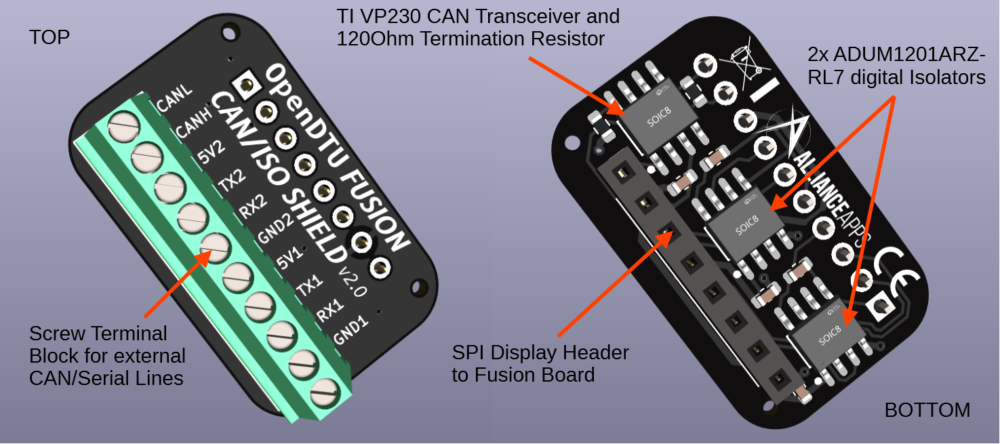

# OpenDTU Fusion



## Overview

This board was developed by [@markusdd](https://github.com/markusdd) and the
help of the OpenDTU/Ahoy Discord community. It integrates all the components
that are necessary to run OpenDTU-OnBattery on 5.5cm x 5.5cm, namely an
ESP32-S3-WROOM-1U module, and the complete RF paths for NRF24 (HM series) and
CMT2300A (HMS/HMT series) communications. So this PCB can interface with all
supported inverters and uses the most modern ESP32-S3 chip.

This board has always shipped with ESP32-S3 modules with at least 8 MB of flash
storage, making this board compatible with the most recent versions of
OpenDTU-OnBattery.

## Ethernet and Power over Ethernet Shield

The [PoE Shield](https://github.com/markusdd/OpenDTUFusionDocs/blob/main/POE.md)
allows connecting OpenDTU-OnBattery using Ethernet to your home network and to
optionally power the board using PoE concurrently.

## OpenDTU-OnBattery Add-On

The [CAN/Iso shield](https://github.com/markusdd/OpenDTUFusionDocs/blob/main/CANIso.md)
is a generic add-on PCB that was specifically designed to allow connecting to
OpenDTU-OnBattery peripherals such as VE.Direct devices and a Pylontech battery.

This shield can be combined with the Fusion mainboard alone, but it can also be
added on top of the PoE shield.

## Firmware

Firmware builds for the `generic_esp32s3_usb` variant are available in
OpenDTU-OnBattery's GitHub [Release
Page](https://github.com/hoylabs/OpenDTU-OnBattery/releases).

OpenDTU-OnBattery also ships an OpenDTU Fusion-specific device profile
(`pin_mapping.json`) in [the code
repository](https://github.com/hoylabs/OpenDTU-OnBattery/blob/master/docs/DeviceProfiles/opendtu_fusion.json).

## Board Documentation

The board-specific documentation is available over at the [OpenDTU Fusion
documentation repository](https://github.com/markusdd/OpenDTUFusionDocs).
