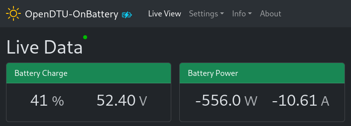

# Overview

Supported battery (management) systems (BMS) can be connected to
OpenDTU-OnBattery. This allows to process battery metrics like its voltage or
state of charge (SoC) by the [Dynamic Power Limiter](dpl.md). The collected
data is also published to the MQTT broker and it is presented in the web UI.

The following data providers (battery interfaces) are supported:

1. **CAN Bus Based Systems:**
   - Pylontech using CAN
   - Pytes using CAN
   - SBS (Smart Battery System) using CAN

2. **UART Based Systems:**
   - [JK BMS](../hardware/jkbms/index.md) using UART
   - JBD BMS (Jin Biao Da BMS) using UART
   - Zendure SuperBase battery systems using UART

3. **VE.Direct Protocol:**
   - Victron SmartShunt using [VE.Direct](../hardware/vedirect.md)

4. **Generic Interfaces:**
   - [MQTT](#mqtt) - for any battery system that publishes data to MQTT

## MQTT

The MQTT battery provider is the most generic interface. Use it if your battery already
publishes state of charge and/or voltage information to the MQTT broker. This option does
not require to separately connect OpenDTU-OnBattery to your battery (management
system), i.e., no setup of hardware is required to use this interface.

Refer to the [MQTT battery settings
documentation](configuration/battery_settings_mqtt.md) for
configuration options.
