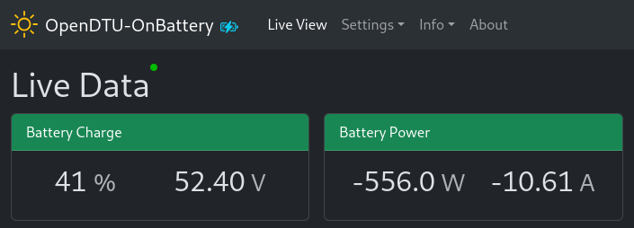

# Overview

Supported battery (management) systems (BMS) can be connected to
OpenDTU-OnBattery. This allows to process battery metrics like its voltage or
state of charge (SoC) by the [Dynamic Power Limiter](dpl.md). The collected
data is also published to the MQTT broker and it is presented in the web UI.

The following data providers (battery interfaces) are supported:

1. Pylontech using CAN
2. Pytes using CAN
3. [JK BMS](../hardware/jkbms/index.md) using UART
4. Victron SmartShunt using [VE.Direct](../hardware/vedirect.md)
5. [MQTT](#mqtt)

## MQTT

The MQTT battery provider is the most generic interface. Use it if your battery already
publishes state of charge and/or voltage information to the MQTT broker. This option does
not require to separately connect OpenDTU-OnBattery to your battery (managemen
system), i.e., no setup of hardware is required to use this interface.

Refer to the [MQTT battery settings
documentation](configuration/battery_settings_mqtt.md) for
configuration options.
