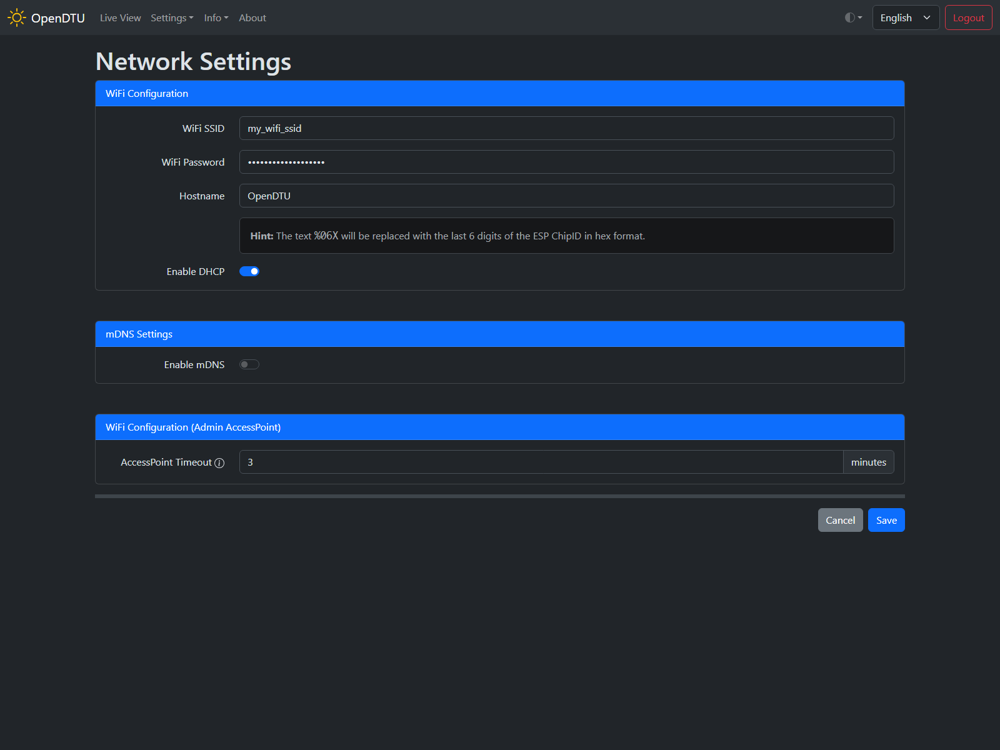

# Network Settings

## Screenshot

## Settings / Parameters

!!! note "Note"
    Some of these settings apply to the Wi-Fi interface and the ethernet interface (if available on your board and configured). If ethernet is connected, the Wi-Fi connection will be disabled and its settings will be transferred to the ethernet interface (also the other way around). The ethernet interface has higher priority.

### WiFi Configuration

#### Wi-Fi SSID :material-form-textbox:{title="Textbox"}

The SSID[^1] / name of your Wi-Fi network.

#### Wi-Fi Password :material-form-textbox:{title="Textbox"}

Optional password for the access point, if required.

#### Wi-Fi Hostname :material-form-textbox:{title="Textbox"}

The host name with which OpenDTU-OnBattery logs on to various services (DNS server, MQTT server, mDNS). This name must be unique in the LAN[^2]. The text `%06X` will be replaced internally by the ChipID of the ESP. This helps to keep the hostname unique. The hostname will be also used if the ESP is connected via ethernet.

#### Enable DHCP :material-toggle-switch:{title="Switch"}

If DHCP is enabled the OpenDTU-OnBattery will request its network information like IP/Netmask/Gateway from e.g. your router. If you disable this function you have to enter these settings manually.

### Static IP Configuration

#### IP Address :material-form-textbox:{title="Textbox"}

IP Address which is assigned to either the Wi-Fi interface or the ethernet interface (if applicable). Format: `xxx.xxx.xxx.xxx`

#### Netmask :material-form-textbox:{title="Textbox"}

The Netmask which is assigned to either the Wi-Fi interface or the ethernet interface (if applicable). Format: `xxx.xxx.xxx.xxx`. The default value for a Class-C network (which you have most likely should be `255.255.255.0`).

#### Default Gateway :material-form-textbox:{title="Textbox"}

The default gateway which is assigned to either the Wi-Fi interface or the ethernet interface (if applicable). Format: `xxx.xxx.xxx.xxx`. For a standard home network this should be the IP of your router (e.g. `192.168.178.1`).

#### DNS Server 1 :material-form-textbox:{title="Textbox"}

The DNS server which is assigned to either the Wi-Fi interface or the ethernet interface (if applicable). Format: `xxx.xxx.xxx.xxx`. For a standard home network this should be the IP of your router (e.g. `192.168.178.1`).

#### DNS Server 2 :material-form-textbox:{title="Textbox"}

Please see [DNS Server 1](#dns-server-1)

### mDNS Settings

#### Enable mDNS :material-toggle-switch:{title="Switch"}

Enables or disables the mDNS publication of the IP address and version the OpenDTU-OnBattery. This is useful to address the DTU in the network with its DNS name if no DNS server (e.g. on the router) is available. The generated mDNS name is composed as follows: `<WiFi Hostname>.local`.

### Wi-Fi Configuration (Admin AccessPoint)

#### AccessPoint Timeout :material-form-textbox:{title="Textbox"}

After each device restart, if no valid Wi-Fi configuration is found or if the configured AccessPoint is not found, an internal AccessPoint is opened. In case that the Wi-Fi configuration is valid and the infrastructure AP[^3] is reachable, the internal AP is closed after the time configured in this setting.

[^1]: [SSID](https://en.wikipedia.org/wiki/Service_set_(802.11_network)#SSID){target=_blank}
[^2]: [Local Area Network](https://en.wikipedia.org/wiki/Local_area_network){target=_blank}
[^3]: [Access Point](https://en.wikipedia.org/wiki/Wireless_access_point){target=_blank}
