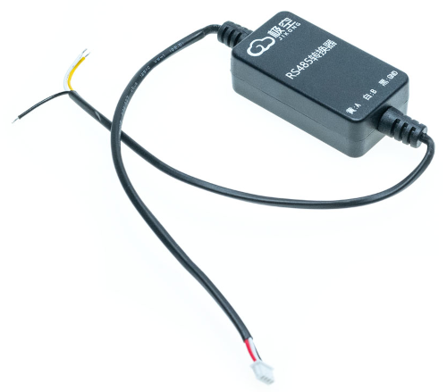

# JK-B* Models


The support for JK BMS was developed and tested against a `JK-B1A24S15P`
model. It is assumed that all JK BMS (in this series) implement the same
protocol on their UART interface. The following models are listed in a manual
that includes the tested model:

```
JK-BD6AxxS-6P  / JK-BD6AxxS-8P
JK-BD6AxxS-10P / JK-BD6AxxS-15P
JK-BD6AxxS-20P / JK-B1AxxS-15P
JK-B2AxxS-15P  / JK-B2AxxS-20P
```

Notice that buying the BMS with the CAN interface or the GPS feature might
conflict with this UART interface.

## Protocols

The `JK-B*` BMS models are connected to the ESP32 using UART-TTL or RS485 using
the JK RS485 adapter:



## RS485-TTL (UART) Jack Pin-Out

This is the pinout of the RS485-TTL (UART) communication jack on an JK BMS (4
Pin, JST SH 1.25mm pitch), which is labeled "GPS":

```
┌────  ─────  ────┐
│                 │
│  O   O   O   O  │
│ GND  RX  TX VBAT│
└─────────────────┘
   │   │   │   └── VBAT is full battery voltage, e.g., 51.2V (do not connect)
   │   │   └────── ESP32 GPIO (RX pin)
   │   └────────── ESP32 GPIO (TX pin)
   └────────────── GND
```


!!!warning "Reversed UART connector"
    On the JK-B1A8S10P/B1A8S20P/B2A8S10P models (possibly others?) the
    connector is soldered on the PCB top side rather than the bottom side, so
    the pin-out above is to be read upside-down! Be cautious with the
    connector's orientation on your particular model!


## Wiring Options

Multiple wiring methods are supported. The `battery.rx` and `battery.tx` pins
must be defined in the pin mapping for all methods. When using the `RS-485
Transceiver on MCU` interface type, `battery.rxen` and `battery.txen` pins must
also be defined. See the [device profile documentation](../../firmware/device_profiles.md)
for more details.

### RS485 with Transceiver

Using the original JK BMS RS485 adapter, the wiring can be completed using an
RS485 transceiver chip that is connected to the ESP32 directly. This is the
case for the [OpenDTU Fusion board](../../3rd_party/opendtu_fusion.md), where
an ISL3178E transceiver is in use. There are also breakout-boards available
that provide a RS485 transceiver (search for `MAX485 Module`).

This setup is very robust and requires four pins on the ESP32: Two for data
(one input, one output), one that controls the receiver, and another that
controls the transmitter. The latter two are outputs.

```
          RS485-TTL               RS485
                                    ┌──────────────────────────────┐
┌────────┐         ┌───────────┐    │    ┌───────────┐   ┌───────┐ │
│        │<--TX--->│Y    JK   Y│<A--+--A>│A      RXEN│<->│15     │ │
│ JK-BMS │<--RX--->│W  RS485  W│<B--+--B>│B        RX│<->│16 ESP │ │
│        │<--GND-->│B Adaptor  │    │    │       TXEN│<->│46  32 │ │
│        │<-Bat V->│R         B│<-->│GND │ISL3178E EN│<->│45     │ │
└────────┘         └───────────┘    │    └───────────┘   └───────┘ │
                                    │       OpenDTU Fusion v2      │
                                    └──────────────────────────────┘
```

Use the `RS485-Transceiver on MCU` interface type in the OpenDTU-OnBattery
settings for this setup.

### RS485 with Converter

Using the original JK BMS RS485 adapter, the wiring can be completed using an
RS485 to UART-TTL converter board. Search for `DEBO TTL-RS485` on
[reichelt.de](https://www.reichelt.de/entwicklerboard-uart-ttl-zu-rs485-converter-debo-ttl-rs485-p316262.html)
for an example. For the UART receive pin on the ESP32 an input-only pin may be
used.

This setup also works over long distances for the RS485 lines.

```
           UART-TTL              RS485           RS485-TTL
┌────────┐         ┌───────────┐       ┌────────┐         ┌───────┐
│        │<--TX--->│Y    JK   Y│<A---A>│        │<TX---RX>│       │
│ JK-BMS │<--RX--->│W  RS485  W│<B---B>│ RS485  │<RX---TX>│ ESP32 │
│        │<--GND-->│B Adaptor B│<-GND->│ to 3V3 │<--GND-->│       │
│        │<-Bat V->│R          │       │        │<--3V3-->│       │
└────────┘         └───────────┘       └────────┘         └───────┘
```

Use the `TTL-UART on MCU` interface type in the OpenDTU-OnBattery settings for
this setup. The ESP32 will talk UART to the converter board. The RS485
transceiver is transparent to the ESP32. That also means it has no explicit
control over the transmitter or receiver. That in turn might cause the ESP32 to
read its own data (only for bad converter boards).

### UART-TTL

The BMS may be connected directly to two ESP32 pins. For the UART receive pin
on the ESP32 an input-only pin may be used.

!!!danger "VBAT"
    Do **NOT** connect the fourth pin (VBAT) of the JK BMS, as it drives the
    unregulated full battery voltage.

!!!note "Interference"
    Use this setup only over short distances as it is not robust against
    interference.

```
          UART-TTL
┌────────┐         ┌───────┐
│        │<TX---RX>│       │
│ JK-BMS │<RX---TX>│ ESP32 │
│        │<--GND-->│       │
│        │   3V3-->│       │
└────────┘         └───────┘
```

Use the `TTL-UART on MCU` interface type in the OpenDTU-OnBattery settings for this setup.
